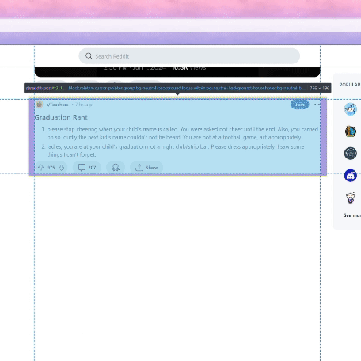

# Custom Content Blocker

Social media sites will often give us content that we don't want to consume. If a user is just on the website to look at cute cat pictures, they probably don't want to hear about the latest genocide in the Middle East. This is exacerbated by the fact that we can easily be drawn into content which makes us sad or angry, encouraging the company's algorithm to continue feeding us content we don't like. This project intends to give users greater control over the content they see. 

This project has many potential applications. For example, there has recently been a trend on social media of posting inflammatory content (ragebait) in order to get attention. If many people use an automatic content blocker, there will be no chance for trolls to catch their attention.

When a user enters a social media site and the content blocker extension is active, they can navigate the social media site like normal. However, if there is a post on the site which is similar to manually blocked content, the extension will blur the post. A user can manually block posts, which will automatically update their blocking preferences

Currently, this only blocks political content. The following video shows how the application automatically hid a political post. I used the inspector to unhide the post.

In this example, it is not immediately obvious that the post is political. It only becomes clear at the bottom, where someone replied referencing the Trump convictions. I was surprised the model correctly classified this, since it would have to read text in the image and notice the replier is talking about an election.

I will note that people may have different ideas of what counts as "political." For example, since it is pride month, there is an influx of pride-related posts which are classified as political.