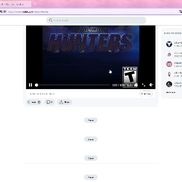

# Custom Content Blocker

Social media sites will often give us content that we don't want to consume. If a user is just on the website to look at cute cat pictures, they probably don't want to hear about some nonsense Tik-Tok ragebait. This is exacerbated by the fact that we can easily be drawn into content which makes us sad or angry, encouraging the company's algorithm to continue feeding us content we don't like. This project intends to give users greater control over the content they see. 

When a user enters a social media site and the content blocker extension is active, they can navigate the social media site like normal. However, if there is a post on the site which is similar to manually blocked content, the extension will blur the post. A user can manually block posts, which will automatically update their blocking preferences

Currently, this only blocks political content. The following video shows how the application automatically hid a political post. 

In this example video, four (!) posts are blocked in a row. Notice the false positive. This is because there are much more nonpolitical posts than political posts, so a false positive is inevitable. It's an anomaly that there were so many political posts in one area.

Notice that BLIP takes both image and text as input, but I modified it so it can handle text alone.